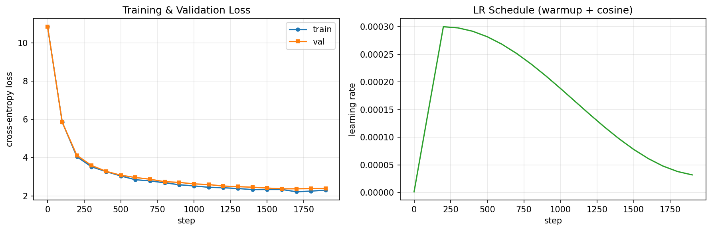

# tinystories-gpt

A GPT-style language model built from scratch in PyTorch and trained on the [TinyStories](https://huggingface.co/datasets/roneneldan/TinyStories) dataset — a corpus of 50,000 short children's stories written using only the ~1,500 most common English words.

Built as part of the *Advances in Deep Generative Models* course in the [MS in Artificial Intelligence program at UT Austin](https://cdso.utexas.edu/msai), inspired by Karpathy's [nanoGPT](https://github.com/karpathy/nanoGPT). Every component is implemented from scratch — no code copied from the reference repository.

---

## What this is

A complete, self-contained implementation of a decoder-only Transformer language model, including:

- Token and positional embeddings
- Causal multi-head self-attention (with FlashAttention dispatch via `F.scaled_dot_product_attention`)
- Feed-forward MLP with GELU activation
- Pre-norm Transformer blocks with residual connections
- KV caching for efficient autoregressive inference
- Full training pipeline with AdamW, cosine LR schedule, gradient accumulation, and mixed precision (bfloat16)
- Temperature and top-k sampling

The model learns to generate grammatically coherent, locally plausible children's stories — and fails in interesting, instructive ways that illuminate how autoregressive language models actually work.

---

## Model architecture

| Hyperparameter    | Value                  |
|-------------------|------------------------|
| Layers            | 6                      |
| Attention heads   | 6                      |
| Embedding dim     | 384                    |
| Head dim          | 64                     |
| Context length    | 256 tokens             |
| Vocabulary        | 50,257 (GPT-2 BPE)     |
| Dropout           | 0.1                    |
| Total parameters  | ~30M                   |

Weight initialization follows GPT-2: weights ~ N(0, 0.02²), biases zero. Residual projections use scaled-down init (σ = 0.02 / √(2L)) to prevent the residual stream from growing with depth. LM head weights are tied to the token embedding matrix.

---

## Dataset and tokenization

**Dataset:** [roneneldan/TinyStories](https://huggingface.co/datasets/roneneldan/TinyStories) — 50,000 synthetic children's stories, each restricted to the ~1,500 most common English words. Stories are grammatically correct, locally coherent, and short enough to fit within a 256-token context window, making this dataset well-suited for small language models.

**Tokenization:** GPT-2 BPE via `tiktoken` (vocabulary size 50,257). `<|endoftext|>` is inserted between stories. A 90/10 train/validation split yields ~9.98M training tokens and ~1.11M validation tokens.

---

## Training

| Setting                  | Value                                      |
|--------------------------|--------------------------------------------|
| Optimizer                | AdamW (β₁=0.9, β₂=0.95, weight decay=0.1) |
| Peak learning rate       | 3 × 10⁻⁴                                  |
| LR schedule              | Linear warmup (10%) + cosine decay         |
| Min learning rate        | 3 × 10⁻⁵                                  |
| Global batch size        | 16,384 tokens/step (8 micro-batches × 8)   |
| Gradient clipping        | 1.0                                        |
| Precision                | bfloat16 (mixed precision autocast)        |
| Steps                    | 2,000                                      |
| Tokens processed         | ~32.8M                                     |
| Training time            | ~5 min on RTX 5090                         |
| Final validation loss    | 2.3665                                     |

Training and validation loss over 2,000 steps:



The train/val gap at convergence is ~0.11 nats — healthy generalization with no signs of overfitting. Validation loss plateaus around step 1,700.

---

## Generated samples

Sampling uses temperature τ = 0.8 and top-k = 50 unless noted.

**Prompt: "Once upon a time"**
> Once upon a time, there was a little rabbit named Nemo. Nemo had lots of fun swimming in the sea. The river was very hot and he didn't want to walk. "I want to get a bath," replied Nemo...

**Prompt: "Once upon a time, the stock market crashed and"** (out-of-domain)
> Once upon a time, the stock market crashed and the little girl was very frustrated. She felt silly because she didn't want to go away. The little girl decided to ask her friend for help...

The model doesn't know what a stock market is — it just knows that when things go wrong, you find a friend.

**Temperature comparison (same prompt: "Once upon a time")**

| Setting | Behaviour |
|---|---|
| τ = 0.01, top-k = 1 (near-greedy) | Stable and grammatical, but loops on high-probability phrases |
| τ = 0.8, top-k = 50 (balanced) | Varied and coherent; occasional spatial/logical inconsistencies |
| τ = 1.2, top-k = 100 (high entropy) | Creative but incoherent; multiple characters appear without narrative structure |

**Repetitive prompt stress test**
> The cat looked at the dog. The dog looked at the cat. The cat looked at the dog...

The model gets trapped in the loop before partially escaping — fluency degrades quickly under adversarially repetitive context.

---

## What I learned

Building this end-to-end gave me concrete intuition that reading papers alone doesn't:

- **Why weight tying works** — and what it costs in expressivity vs. parameters saved
- **How the residual stream accumulates information** across layers, and why the scaled-down init for residual projections matters
- **What temperature actually does** to the logit distribution — not abstractly, but visibly, in generated text
- **Why small models fail the way they do** — distribution anchoring, repetition under low entropy, prompt fidelity only at the opening tokens
- **How training dynamics play out** — the loss curve shape, warmup behavior, and where validation loss stops responding to more steps

---

## Repository structure

```
tinystories-gpt/
├── tinystories-gpt.ipynb       # Full implementation, training, and evaluation
├── README.md
└── assets/
    └── loss_curve.png    # Training and validation loss plot
```

---

## Requirements

```
torch >= 2.0
tiktoken
datasets (HuggingFace)
matplotlib
numpy
```

Install with:

```bash
pip install torch tiktoken datasets matplotlib numpy
```

A CUDA GPU is strongly recommended. The notebook was trained on an RTX 5090; any modern GPU with ≥8GB VRAM should work for this model size.

---

## References

- Karpathy, A. [nanoGPT](https://github.com/karpathy/nanoGPT)
- Eldan, R. & Li, Y. [TinyStories: How Small Can Language Models Be and Still Speak Coherent English?](https://arxiv.org/abs/2305.07759) (2023)
- Radford, A. et al. [Language Models are Unsupervised Multitask Learners](https://cdn.openai.com/better-language-models/language_models_are_unsupervised_multitask_learners.pdf) (GPT-2, 2019)
- Vaswani, A. et al. [Attention Is All You Need](https://arxiv.org/abs/1706.03762) (2017)

---

*Built as coursework for Advances in Deep Generative Models — MS in Artificial Intelligence, UT Austin.*
